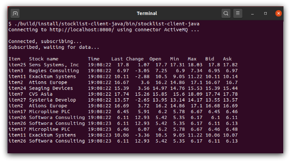

# Lightstreamer JMS Extender - Basic Stock-List Demo - Java SE Client

<!-- START DESCRIPTION lightstreamer-jms-example-stocklist-client-java -->

This project contains a sample Java application that shows how the **Lightstreamer JMS Extender JavaScript Client Library** can be used to connect to Lightstreamer JMS Extender.

<br>

## Details

This demo displays real-time market data for 20 stocks, generated by the feed simulator included in the [Stock-List Demo Java Service](https://github.com/Lightstreamer/Lightstreamer-JMS-example-StockList-service-java). For simplicity, only the "stock_name" and "last_price" fields of updated items are displayed, and they are just logged to the console. Moreover, a single JMS topic is used for all stocks, while in a real scenario you would probably use a different JMS topic for each stock.

This examples uses the [_Lightstreamer JMS Extender Node.js Client API_](https://www.npmjs.com/package/lightstreamer-jms-nodejs-client/) to handle the communications with JMS Extender.

Check out the sources for further explanations.

## Build

If you want to build and install a version of this demo pointing to your local Lightstreamer JMS Extender, follow these steps:

* Note that, as prerequisite, the [Lightstreamer JMS Extender - Stock-List Demo - Java (JMS) Service](https://github.com/Lightstreamer/Lightstreamer-JMS-example-StockList-service-java) has to be deployed on your local Lightstreamer JMS Extender instance. Please check out that project and follow the installation instructions provided with it.

* Launch Lightstreamer JMS Extender.

* Run `Gradle` as follows:

  ```sh
  $ ./gradlew installDist
  ```
The `installDist` task will create a distribution of the project under the `build/install/stocklist-client-java` folder, from which you can start the client.


## Start the Client

From `build/install/stocklist-client-java`, launch:

```sh
 $ ./bin/stocklist-client-java --server http://localhost:8080 --connector ActiveMQ
```
You can also address any JMS Extender instance by specifying proper values for `--server` and `--connector` parameters.

## See Also

### Lightstreamer Service Needed by This Demo Client

<!-- START RELATED_ENTRIES -->
* [Lightstreamer JMS Extender - Stock-List Demo - Java (JMS) Service](https://github.com/Lightstreamer/Lightstreamer-JMS-example-StockList-service-java)

<!-- END RELATED_ENTRIES -->
### Related Projects

* [Lightstreamer JMS Extender - Basic Stock-List Demo - HTML Client](https://github.com/Lightstreamer/Lightstreamer-JMS-example-StockList-client-javascript)
* [Lightstreamer JMS Extender - Basic Stock-List Demo - Node.js Client](https://github.com/Lightstreamer/Lightstreamer-JMS-example-StockList-client-node)
* [Lightstreamer - Stock-List Demos - HTML Clients](https://github.com/Lightstreamer/Lightstreamer-example-StockList-client-javascript)

## Lightstreamer Compatibility Notes

* Compatible with Lightstreamer JMS Extender Java Client Library since version 2.0.0 or newer.
* Compatible with Lightstreamer JMS Extender since version 2.0.0 or newer.
